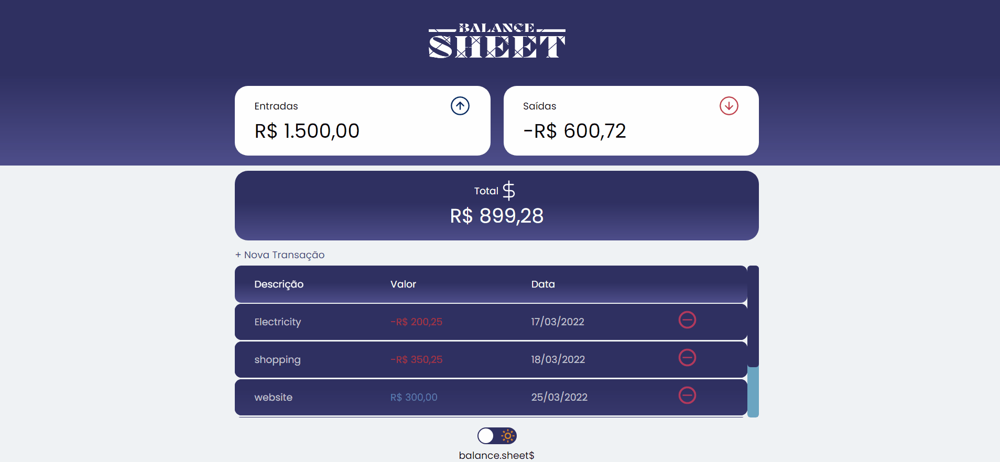
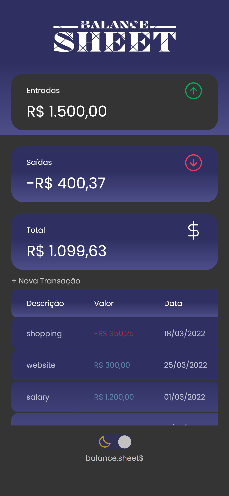

<h1 align="center">
  
</h1>

  <a href="#-Technologies">Technologies</a>&nbsp;&nbsp;&nbsp;|&nbsp;&nbsp;&nbsp;
  <a href="#-Project">Project</a>&nbsp;&nbsp;&nbsp;|&nbsp;&nbsp;&nbsp;
  <a href="#-Layout">Layout</a>&nbsp;&nbsp;&nbsp;|&nbsp;&nbsp;&nbsp;
  <a href="#memo-License">License</a>

 

 

 

   
  

 

# 🚀 Technologies

This project was developed with the following technologies:

- HTML
- CSS
- JavaScript

 

# 💻 Project

The Balance Sheet was developed to store all your expenses and income. Doing all the calculations automatically so you know if you're positive or negative in the month.

You can remove any transaction at any time.

The application contains dark mode to suit your taste.

The application is responsive, also working on mobile devices.

 

# 🔖 Layout

You can view the project layout through [desse link](https://exodogurgel.github.io/BalanceSheet/).

 

# :memo: License

This project is under the MIT license. See the file [LICENSE](https://github.com/exodogurgel/Countdown/blob/main/LICENSE) for more details.

---

Made with ♥ by Êxodo Gurgel :wave: 